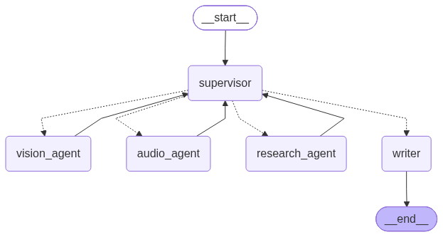

# Supervisor Agent Multi-Agent Architecture

Most agentic architectures have a supervisor who then calls other agents dependent on the task. This repository is nothing new, and all of the models used are from API calls. This is to simply demonstrate how ChatBots, which are all agentic, work.

## About

Multi-Agentic Architectures come in two forms:

1. **Supervisor**: This agent oversees all of the subagents which then report back to the supervisor. The supervisor manages how the sub-agents behave.
2. **No-Supervisor**: There is no central supervisor and all agents either compete or cooperate to complete a task.




## Getting Started

```bash
git clone https://github.com/nickkats1/MAS-langgraph.git
cd MAS-langgraph
python3 -m venv venv
source venv/bin/activate
pip install -r requirements.txt

python main.py
```

Then open http://localhost:8080. You can type a question and add an image or audio file if you want.

## API Keys

An OpenAI API key is required. It is used for the default model (`gpt-4o`) and for audio transcription (`whisper-1`).
A Groq API key is only needed if you switch `MODEL_NAME` to a Groq model.

Create a `.env` file in the project root:

```
OPENAI_API_KEY=sk-...
GROQ_API_KEY=gsk_...
MODEL_NAME=openai:gpt-4o
```

`GROQ_API_KEY` and `MODEL_NAME` are optional. `MODEL_NAME` defaults to `openai:gpt-4o`.

**Never share your API key with anyone or anything.**


### About

Agents, generally speaking, are just an LLM that can call tools and decide what to do next. Here the supervisor never answers the user itself. It looks at what it has so far and picks the next agent:

- **vision_agent**: answers a question about an uploaded image using ViLT (`dandelin/vilt-b32-finetuned-vqa`), which runs locally on your CPU.
- **audio_agent**: turns an uploaded audio file into text with OpenAI's `whisper-1`.
- **research_agent**: searches the web with DuckDuckGo.
- **writer**: takes everything the other agents found and writes the final answer.

Each agent reports back to the supervisor. The vision and audio agents only run if you actually uploaded a file, no agent runs twice, and after 6 steps the supervisor hands everything to the writer so it can't loop forever.

## Docker

```bash
docker compose -f docker/docker-compose.yml up --build
```

It reads the same `.env` file. The image downloads the ViLT model while it builds, so the first build takes a while.

## Tests

```bash
pytest
```


## LICENSE

MIT


